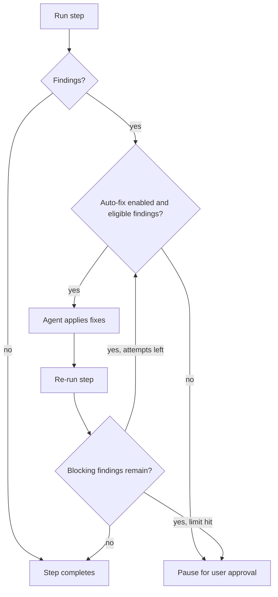

When a pipeline step finds issues, `no-mistakes` can automatically ask the agent to fix them before pausing for your approval. This is controlled by the `auto_fix` configuration.

## How it works

1. A step executes and returns findings (e.g., test failures, lint warnings, review issues)
2. If `auto_fix` is enabled for that step (limit > 0) and the attempt count is below the limit, the executor re-runs the step with `fixing=true`
3. The agent receives the previous findings and applies fixes
4. The step re-runs to verify the fixes
5. If issues remain and attempts are left, the loop continues
6. Once the limit is reached or all issues are resolved:
   - If issues remain, the step pauses for user approval
   - If everything passes, the step completes and the pipeline moves on

The document step applies fixes during its initial pass instead of relying on a follow-up automatic fix loop.
When `commands.lint` is empty, that same invocation is a combined documentation-and-lint housekeeping pass: it updates documentation, detects relevant linters and formatters, applies safe fixes, verifies both duties, and categorizes any unresolved findings for the document or lint gate.
The lint step consumes a usable lint result from that pass instead of starting a second cold agent invocation; when the combined pass is skipped, cannot produce trustworthy structured output, or loses its in-memory result across a daemon restart, lint falls back to its own agent pass.
Unresolved documentation findings and unresolved blocking lint findings pause for approval instead of entering another automatic fix loop.

## Configuration

Per-step attempt limits come from the `auto_fix` config object; the [`auto_fix` field reference](/no-mistakes/reference/global-config/#auto_fix) owns the defaults, per-step meanings, and the legacy alias.
Setting a step to `0` disables the follow-up auto-fix loop, so the pipeline pauses for human input when that step finds issues; `auto_fix.review` defaults to `0`, so review findings require manual approval unless you opt in.
Repo config overlays global config field by field - you can set `auto_fix.lint: 5` in a repo's `.no-mistakes.yaml` to override just that step while inheriting the rest from global.

## Finding actions

Agent-driven findings now use an `action` field instead of `requires_human_review`:

- `auto-fix` - objective issues that can be fixed automatically
- `ask-user` - intent-sensitive or ambiguous issues that pause for approval instead of entering the normal auto-fix loop
- `no-op` - informational notes that do not need a fix

If an agent or integration omits `action`, no-mistakes fails closed by treating the finding as `ask-user`.
An unclassified finding is never eligible for automatic fixing.

`ask-user` is meant for findings that need human judgment - for example, questioning an intentional product or design choice, arguing that an intentional addition, removal, or guard should be undone, or reporting that the test step could not produce enough evidence for the available intent. Routine correctness, reliability, or security fixes still stay `auto-fix` even if the smallest fix reintroduces a small amount of previously deleted logic. Agents driving the AXI skill should relay `ask-user` findings to the user unless they have explicit `--yes` consent to resolve gates unattended.
In the TUI, yolo mode is an explicit override that auto-resolves paused steps by treating `auto-fix` and `ask-user` findings as consent to run one fix round.
Steps with only `no-op` findings are approved as-is.

The `review`, `test`, and configured-command `lint` steps use this shared model directly. The `document` step also uses the same `action` field, but unresolved documentation findings pause for approval because the initial document pass already attempted the documentation updates it could make safely.
When `commands.lint` is empty, the combined housekeeping pass routes documentation and lint findings to their owning gates. Its unresolved lint findings describe issues left after safe fixes, so blocking findings pause for approval instead of remaining eligible for another automatic fix loop.

Documentation findings use the same approval UI, but the `document` step treats any finding as an unresolved documentation gap or judgment call that should pause for approval.

## User-triggered fixes

When the pipeline pauses for approval, you can manually trigger a fix from the TUI or AXI interface:

1. The findings panel shows all findings with checkboxes
2. Toggle individual findings with `space`, or use `A` (all) / `N` (none)
3. Optionally press `e` to attach a note to the current finding, or `+` to add your own finding to the fix request
4. Press `f` to fix the selected findings

The agent receives the merged fix payload for that round: the selected agent findings, any per-finding user notes, any selected user-authored findings added from the TUI or AXI interface, and a sanitized history of previous rounds for that step.
That history includes which finding IDs were selected for a prior fix attempt, which findings were left unselected by the user, and any one-line summaries from earlier fix commits.
On follow-up review passes, that history tells the agent not to re-report user-ignored findings unless the code now presents a materially different issue.

After a user-triggered fix, the step re-runs and pauses again to show you the results (`fix_review` status). You can then approve, fix again, skip, or abort.
Yolo and AXI `--yes` approve that fix review automatically after their one fix round, so a finding that remains after the fix does not trigger an unbounded fix loop.

## Fix commits

Each auto-fix cycle commits its changes with a descriptive message. The combined document-and-lint housekeeping pass runs in the Document step, so its documentation and safe lint fixes use the Document prefix; configured-command lint fixes use the Lint prefix:

| Step | Commit prefix |
|---|---|
| Rebase | `no-mistakes(rebase): 
` |
| Review | `no-mistakes(review): 
` |
| Test | `no-mistakes(test): 
` |
| Document | `no-mistakes(document): 
` |
| Lint | `no-mistakes(lint): 
` |

The push step commits any remaining uncommitted changes with `no-mistakes: apply agent fixes`.

## Step rounds

Each execution of a step (initial run or follow-up auto-fix run) is recorded as a "round" in the database.
A round stores its findings, duration, any selected finding IDs and whether that selection came from the user or auto-fix filtering, the merged finding payload actually sent to the fix agent for that round, and any one-line fix summary from that execution.
That merged payload can include per-finding user notes and user-authored findings added from the TUI or AXI interface.
AXI status uses the same round history and the persisted auto-fix limit to show the active fix attempt, for example `auto-fix 1/3` or `fix 2`.
The step log records a marker when each automatic or user-triggered fix round starts.
The PR body's deterministic risk assessment, testing, and pipeline sections are built from these rounds, giving reviewers visibility into test results, review risk, what was fixed, and how many attempts it took.
In PR pipeline details, auto-fix rounds are rendered as an issue -> fix -> verification narrative instead of a round-numbered log: each fix summary is followed by either a successful re-check or the findings still open after that fix.
On very long runs, the PR body uses a 63,488-byte safety cap, which leaves a 2 KB buffer below GitHub's 65,536-character body limit.
It first keeps the newest pipeline update rounds and replaces older rounds with an omission marker at whole-update boundaries.
If the newest update or essential body content is still too large, the PR step truncates at line or section boundaries and adds an explicit marker.
The full round history remains available in the run log.

Round trigger types:
- `initial` - first execution
- `auto_fix` - triggered by the automatic fix loop
- `auto_fix` - also used when you press `f` in the TUI or use `no-mistakes axi respond --action fix` to run a follow-up fix

Legacy `user_fix` rounds are still rendered as `auto-fix` in PR summaries for backward compatibility.
