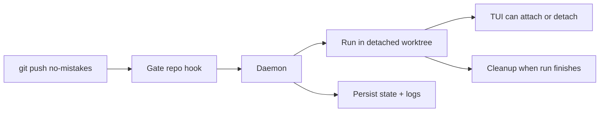

The daemon is a long-running background process that manages pipeline runs. The
installer prefers setting it up as a managed background service, and
`no-mistakes`, `init`, `attach`, `rerun`, and `update` keep that service
installed and running for you when that path is available.

## Why a daemon exists

The daemon exists so `git push no-mistakes` stays fast and the gate can keep
working after your shell command returns.

- Git hands the push to the local gate repo.
- The hook notifies the daemon and exits immediately.
- The daemon owns the long-running work: worktrees, pipeline execution, TUI
  events, state, cleanup, and crash recovery.



On macOS this is a per-user `launchd` agent, on Linux a per-user `systemd` service, and on Windows a Task Scheduler task. The installed artifact names are scoped by `NM_HOME` with a short stable suffix, so the paths and service identifiers look like `~/Library/LaunchAgents/com.kunchenguid.no-mistakes.daemon.<suffix>.plist`, `~/.config/systemd/user/no-mistakes-daemon-<suffix>.service`, and the Windows task `no-mistakes-daemon-<suffix>`. That keeps multiple `no-mistakes` installs from colliding when they use different `NM_HOME` roots. Those service managers keep the daemon available across CLI invocations and restart it after `no-mistakes update` replaces the binary. Before a managed daemon run starts, `no-mistakes` reloads the environment from your login shell on macOS and Linux and augments `PATH` with common user, Homebrew, and system binary directories so agent and tool discovery is not limited to the service manager's minimal environment. If login-shell resolution fails, it logs a warning and uses an augmented process-environment fallback that may omit version-manager directories. On Windows it reuses the current process environment instead of shelling out to a login shell. If managed service install or startup is unavailable or fails, `no-mistakes` falls back to starting a detached daemon process instead.

## Starting and stopping

Most people do not need to manage the daemon directly. The usual commands
already make sure it exists when needed.

```sh
# Explicit management
no-mistakes daemon start
no-mistakes daemon stop
no-mistakes daemon restart
no-mistakes daemon status

# Ensures the daemon is running, using the managed service when possible
no-mistakes
no-mistakes init
no-mistakes attach
no-mistakes rerun
no-mistakes axi run
no-mistakes axi respond

# Resets the daemon after replacing the binary
no-mistakes update
```

`no-mistakes update` stops and starts the daemon when it is running, or when stale daemon artifacts exist, so the new executable is used.
It prefers the managed service path and falls back to a detached daemon if service startup is unavailable or fails.
If pending or running pipeline runs exist, update warns that restarting the daemon can cause those runs to fail and prompts before continuing.
If the daemon is already running from a different executable path, update prompts before replacing it.
Pass `-y` or `--yes` to continue through update safety prompts while still printing warnings.
If the daemon executable path cannot be determined, the update aborts before replacing anything.

The daemon writes an identity record to `~/.no-mistakes/daemon.pid` and listens on a Unix socket at `~/.no-mistakes/socket`. On Windows, it uses a localhost TCP listener and a protected endpoint file at the same path.

## What it does

When a push arrives via the post-receive hook:

1. Creates a detached worktree at `~/.no-mistakes/worktrees/<repoID>/<runID>/`
2. Starts the pipeline executor in that worktree
3. Streams events to any connected TUI clients and serves request/response state to AXI clients
4. Cleans up the worktree when the run finishes (success or failure)

Pipeline agents are prompted to keep intentional writes inside that detached worktree and avoid changing system state outside it, such as Homebrew packages, apps under `/Applications`, or global tool configuration.
That reduces surprising machine-level side effects and macOS App Management prompts, but it is prompt steering rather than a true sandbox.

## Concurrent push handling

If you push to the same branch while a run is already active, the daemon:

1. Cancels the in-progress run (reason: "cancelled: superseded by new push")
2. Waits for it to finish
3. Starts a new run with the latest push

Pushes to different branches run concurrently.

This is another reason the daemon exists: branch-level coordination is easier to
reason about in one long-lived process than inside independent hook invocations.

## Crash recovery

On startup, the daemon checks for runs that were left in `pending` or `running` status (which means the daemon crashed while they were active):

- Marks those runs as `failed` with the message "daemon crashed during execution"
- Reaps orphaned managed agent servers left behind by a crashed daemon or setup wizard
- Removes any orphaned worktree directories via `git worktree remove --force`
- Refreshes legacy no-mistakes-managed `post-receive` hooks, installs missing managed hooks, and leaves custom hooks untouched
- Reapplies per-worktree gate hook-path isolation to existing bare repos when Git supports `config --worktree`, so shared `core.hookspath` writes cannot disable `post-receive`
- Enables Git push-option support on existing gate repos so per-push options like `no-mistakes.skip=...` keep working after upgrades
- Clears any parked-awaiting-agent marker so a recovered failed run is not shown as still waiting for `axi respond`

## Logging

Daemon logs go to `~/.no-mistakes/logs/daemon.log`. The setup wizard captures managed agent-server output in `~/.no-mistakes/logs/wizard-agent.log`. Each pipeline step also writes to its own log at `~/.no-mistakes/logs/<runID>/<step>.log`, and fatal step errors are appended there so the step log includes the failure reason even when the detail comes from command stderr.

Set the log level in global config:

```yaml
log_level: debug  # debug | info | warn | error
```

## Shutdown

`no-mistakes daemon stop` stops the current daemon process without removing the managed service. The next `no-mistakes daemon start`, `no-mistakes`, `init`, `attach`, `rerun`, or `update` will start it again through the same service manager when available, or as a detached daemon otherwise.

1. Cancels all active runs
2. Waits up to 30 seconds for goroutines to finish
3. Removes the PID file and socket
