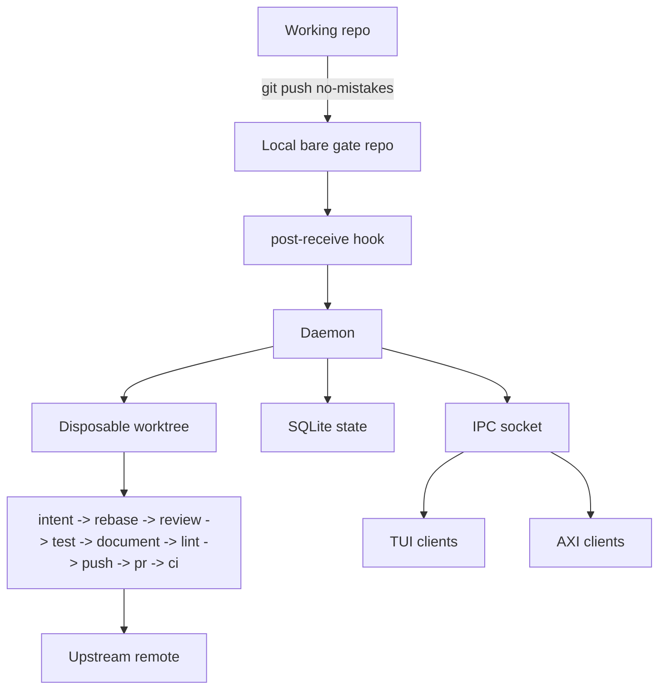

`no-mistakes` intercepts pushes by placing a local bare git repo between your
working repo and the real upstream remote. That bare repo is the gate.

The point is not to hide Git. The point is to create one deliberate place where
validation can happen before a branch is shared.

## Architecture overview

## What `no-mistakes init` does

When you run `no-mistakes init` in a repo:

1. It creates a local bare gate repo under `~/.no-mistakes/repos/<id>.git`.
2. It installs a `post-receive` hook in that gate repo.
3. It enables Git push options for the gate repo.
4. It best-effort isolates the gate repo's hooks path from shared local Git config writes when Git supports `config --worktree`.
5. It adds a `no-mistakes` remote to your working repo that points at the gate.
6. It installs or refreshes the `/no-mistakes` agent skill at user level, into `~/.claude/skills/no-mistakes/SKILL.md` and `~/.agents/skills/no-mistakes/SKILL.md`, on a best-effort basis, following existing symlinks between the home `.claude` and `.agents` skill directories. It writes no skill files into the repo; if the repo still carries a vendored copy from an older version, `init` prints a notice that the copy can be removed.
7. It makes sure the daemon is running so incoming pushes can start runs.

`init` is idempotent.
If the repo is already initialized, it refreshes the existing gate instead of failing: managed hook installation, push-option support, hook-path isolation, gate and working remotes, origin/default-branch metadata, and the `/no-mistakes` agent skill are repaired or updated where needed.
If the working repo was renamed or moved and the old path no longer exists, `init` reattaches the existing gate from the leftover `no-mistakes` remote, updates the stored working path, and preserves the repo ID plus run history.
If the working repo was copied and the original path still exists, `init` treats the copy as a new repo and repoints the copied `no-mistakes` remote to a fresh gate.
If daemon startup fails during a refresh, `init` reports the error but does not eject the pre-existing gate.

After init, your original `origin` still points at the real upstream remote.
That is a core design choice, not an implementation detail.

## How a push flows

1. You run `git push no-mistakes <branch>`.
2. Git writes the push into the local bare gate repo, so the push itself stays fast.
3. The gate repo's `post-receive` hook notifies the daemon.
4. The daemon creates a detached worktree for this run.
5. The pipeline runs in order: `intent -> rebase -> review -> test -> document -> lint -> push -> pr -> ci`.
6. If a step pauses, you can attach with the TUI or use `no-mistakes axi respond` to approve, fix, skip, or abort.
7. After local checks pass, the push step forwards the branch upstream and the PR step creates or updates the pull request.
8. The CI step keeps watching the open PR until it is merged or closed, and can auto-fix failures or merge conflicts when supported.
   While it watches, the TUI and terminal title surface a `Checks passed` signal once checks are green and the PR is mergeable, and `no-mistakes axi` returns `outcome: checks-passed` with instructions to summarize the run and list any pipeline fixes, so agents stop and ask you to review and merge it.

**Key design decisions:**

- **Named remote** - `origin` is never hijacked. You push to `no-mistakes` on purpose, so regular `git push` still works normally.
- **Disposable worktrees** - each run happens in its own detached worktree under `~/.no-mistakes/worktrees/`. The daemon can safely modify files, run tests, and commit fixes without touching your working directory.
- **Fixed pipeline** - the step order is opinionated and not configurable: `intent → rebase → review → test → document → lint → push → pr → ci`. What you _can_ configure is the commands each step runs, how many auto-fix attempts are allowed, and whether transcript-based intent extraction is used when intent is not supplied directly.

## Why it is built this way

### Named remote

The remote is explicit because trust matters. `no-mistakes` is an opt-in gate,
not a trap door that silently rewires normal Git behavior.

### Bare gate repo

The local bare repo gives Git a normal place to receive pushes. That keeps the
push path simple and lets a standard `post-receive` hook hand work off to the
daemon.

### Daemon

The daemon owns long-running work: creating worktrees, running the pipeline,
streaming events, tracking state, and recovering from crashes. Without it, the
CLI would need to stay attached to every run.

### Disposable worktrees

The worktree is where `no-mistakes` can safely rebase, run commands, let the
agent edit files, and commit fixes. Your day-to-day working tree stays clean.

## Component overview

### Post-receive hook

When `git push no-mistakes <branch>` lands, the bare repo's `post-receive` hook
fires. It calls `no-mistakes daemon notify-push` with the gate path, ref name,
old/new SHAs, and any Git push options such as `no-mistakes.skip=test,lint`.
The hook never blocks the push - Git ignores `post-receive` exit status, so
pushes still succeed - but notification failures are surfaced to the pushing
client on stderr and appended to `notify-push.log` in the bare repo for later
inspection.

### Daemon

A long-running background process that manages pipeline runs. It:

- Listens on a Unix socket at `~/.no-mistakes/socket`
- Writes its identity record to `~/.no-mistakes/daemon.pid`
- Serializes concurrent pushes to the same branch (new push cancels the in-progress run)
- Creates and cleans up worktrees
- Persists state to SQLite
- Streams events to connected TUI clients via IPC

The installer prefers setting up the daemon as a managed background service, and `no-mistakes`, `init`, `attach`, `rerun`, and `update` make sure the daemon is running when needed.
Bare `no-mistakes` then attaches to the active run on the current branch when one exists, or routes to the setup wizard when it needs to create a new branch/run.
If managed service install or startup is unavailable or fails, startup falls back to a detached daemon process.
`update` resets the daemon after replacing the binary when the daemon is running or stale daemon artifacts exist.
If pending or running pipeline runs exist, `update` warns that restarting the daemon can cause those runs to fail and prompts before continuing.
If the daemon is already running from a different executable path, `update` prompts before replacing it.
The `-y` / `--yes` flag continues through update safety prompts while still printing warnings.
If the daemon executable path cannot be determined, `update` aborts before replacing anything.
You can also manage it explicitly with `no-mistakes daemon start|stop|restart|status`.

On startup, the daemon recovers from crashes by marking any stuck runs as failed, reaping orphaned managed agent servers, cleaning up orphaned worktrees, refreshing legacy no-mistakes-managed `post-receive` hooks, enabling push options for older gate repos, and reapplying gate hook-path isolation when Git supports `config --worktree`.

### Pipeline executor

The executor runs each step sequentially and manages the approval/fix loop. It
can also end early after `rebase` if the branch has no diff against the default
branch, marking the remaining steps as skipped.

1. Execute the step
2. If the step finds `action: auto-fix` findings, the step result is auto-fixable, and auto-fix is enabled, loop back with the agent to fix them (up to the configured limit)
3. If blocking findings remain, or any finding has `action: ask-user`, pause and wait for user action
4. `action: no-op` findings are informational only; the user can approve, fix selected findings, skip, or abort when the step pauses

### IPC

Communication between the CLI and daemon uses JSON-RPC 2.0 over the Unix socket. The `subscribe` method streams real-time events (step progress, log chunks, findings) to the TUI, while the `axi` commands use request/response IPC for non-interactive agent control.

### Database

SQLite at `~/.no-mistakes/state.sqlite` tracks repos, runs, step results, step
rounds, and derived intent summaries. Step rounds record each execution attempt
(initial, auto-fix) with its own findings and duration, plus selected finding
IDs, whether the selection came from the user or auto-fix filtering, the merged
finding payload actually sent to the fix agent for that round, and the one-line
fix summary for fix rounds. That merged payload can include per-finding user
notes and user-authored findings from the TUI or AXI interface. Intent stores
the summary, source, session ID, and match score on each run when transcript
matching is used, plus cached summaries for matching transcript sessions. An
agent-supplied AXI intent is stored directly on the run. Raw transcript text is
not stored in this database. Legacy `user_fix` rounds are still read as
`auto-fix` for backward
compatibility.

## Local state

Everything lives under `~/.no-mistakes/` by default. Set `NM_HOME` to relocate it.

| Path | Contents |
|---|---|
| `state.sqlite` | SQLite database |
| `socket` | Unix domain socket for IPC |
| `daemon.pid` | Daemon identity record |
| `config.yaml` | Global configuration |
| `update-check.json` | Cached update check result |
| `servers/` | PID-tracking records for managed agent servers |
| `repos/<id>.git` | Bare gate repos |
| `repos/<id>.git/notify-push.log` | Persistent hook notification failure log |
| `worktrees/<repoID>/<runID>/` | Disposable worktrees (cleaned up after each run) |
| `logs/<runID>/<step>.log` | Per-step log files |
| `logs/daemon.log` | Daemon log |
| `logs/wizard-agent.log` | Managed agent-server output captured during setup wizard runs |

New repo IDs are the first 6 bytes (12 hex chars) of `sha256(absolute_working_path)`.
When an initialized working repo is renamed or moved, `init` preserves the existing repo ID instead of deriving a new one from the new path.
