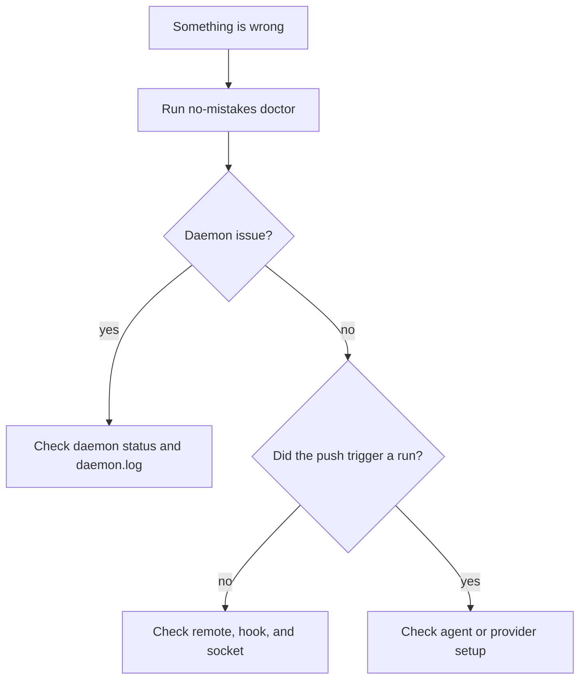

Most problems fall into one of three buckets: daemon not running, agent not
found, or push not triggering the pipeline. This page walks each one.

First stop for anything: `no-mistakes doctor`.

## Debug in this order



That order matches the actual boundaries in the system:

- local environment and binaries
- daemon and gate wiring
- provider-specific PR or CI integration

## Daemon won't start

Symptoms: `no-mistakes daemon status` shows stopped, or `no-mistakes` exits with "daemon not running."

### Start it manually

```sh
no-mistakes daemon start
```

This installs or refreshes the managed service (launchd, systemd user service, or Task Scheduler), then starts it. If service install or startup fails, it falls back to a detached daemon.

### Check logs

```sh
tail -f ~/.no-mistakes/logs/daemon.log
```

### Check for stale artifacts

Stale PID files or sockets from a crashed daemon can block startup:

```sh
ls -la ~/.no-mistakes/daemon.pid ~/.no-mistakes/socket
```

If the PID file points at a process that's no longer running, remove both and run `no-mistakes daemon start` again.

### Managed service logs

- **macOS (launchd):** `launchctl list | grep no-mistakes` and check `~/Library/LaunchAgents/com.kunchenguid.no-mistakes.daemon.*.plist`
- **Linux (systemd):** `systemctl --user status no-mistakes-daemon-*` and `journalctl --user -u no-mistakes-daemon-* -f`
- **Windows (Task Scheduler):** `schtasks /query /tn "no-mistakes-daemon-*"`

### `NM_HOME` collisions

If you have multiple installs with different `NM_HOME` roots, each gets its own scoped service name (with a short suffix derived from the path). Make sure you're looking at the right one - `no-mistakes daemon status` reports which.

## `no-mistakes update` prompts or aborts

Symptom: `update` says the daemon is running from a different executable path, or aborts because the daemon executable path cannot be determined.

When the running daemon uses a different binary, `update` prompts before replacing it. Pass `no-mistakes update -y` to confirm non-interactively.

If the daemon executable path can't be determined at all (stale PID, permissions), the update aborts before replacing anything.

Fix:

```sh
no-mistakes daemon stop
no-mistakes update
```

## Agent binary not detected

Symptom: `doctor` shows `–` for your native agent, or the pipeline errors with "agent binary not found."

### Check PATH

The daemon uses the same binary-discovery order described in [Choosing an Agent](/no-mistakes/guides/agents/). When it's running through a managed service, it reloads `PATH` from your login shell on macOS and Linux and appends common install locations such as `~/.local/bin`, `~/go/bin`, `~/.cargo/bin`, `~/bin`, `/opt/homebrew/bin`, `/usr/local/bin`, `/usr/bin`, and `/bin`.

If a native agent is installed in a version-manager shim directory or another nonstandard location, set an explicit override in `~/.no-mistakes/config.yaml`:

```yaml
agent_path_override:
  claude: /Users/you/.local/bin/claude
```

For `agent: acp:<target>`, set `acpx_path` instead:

```yaml
acpx_path: /Users/you/.local/bin/acpx
```

The daemon logs its effective `PATH` at startup in `~/.no-mistakes/logs/daemon.log` with the message `daemon environment ready`. If the log contains `login shell environment resolution failed` or `login shell environment resolution returned no entries`, the daemon used a degraded fallback `PATH` that may omit version-manager directories such as nvm, fnm, or volta, so tools like `pnpm` may be missing.

### Restart the daemon after installing a new agent

```sh
no-mistakes daemon stop
no-mistakes daemon start
```

## macOS App Management prompts during agent runs

Pipeline prompts steer agents to keep intentional writes inside the disposable worktree and avoid mutating system locations such as `/Applications`, Homebrew-managed packages, or global tool configuration.
This reduces macOS App Management prompts from agent-invoked commands, but it is not an OS sandbox.

If you still see prompts, check the step log for commands that intentionally write outside the worktree and move that setup into your normal development environment or an explicit repo-local command.
Requested test evidence may still be written under the managed temporary `no-mistakes-evidence` directory, or under the configured in-repo evidence directory when `test.evidence.store_in_repo` is enabled.
Normal tool temp or cache writes can still happen outside the worktree.
Testing prompts ask agents to remove transient working-tree artifacts they created, such as downloaded models, caches, build outputs, large binaries, or generated data directories, before completion.

## A pipeline step failed

Symptom: a run stops with a failed step.

Check the per-step log at `~/.no-mistakes/logs/<runID>/<step>.log`.
Fatal step errors are appended to that log, so failures such as rejected pushes include the returned error output there instead of only appearing in `daemon.log`.

## `git push no-mistakes` doesn't start a pipeline

Symptom: push succeeds but `no-mistakes` shows no active run.

### Check the remote

```sh
git remote -v | grep no-mistakes
```

If it's missing, run `no-mistakes init` again.

### Check the hook

The gate's bare repo has a `post-receive` hook that notifies the daemon. Look at the gate path:

```sh
no-mistakes status
# gate path is shown in the output

ls -la <gate-path>/hooks/post-receive
```

The hook should be executable. If it's missing or non-executable, `no-mistakes init` will reinstall it.
For existing gate repos, `no-mistakes daemon restart` also installs missing no-mistakes-managed hooks and refreshes legacy managed hooks without overwriting custom hooks.

Also check `<gate-path>/notify-push.log`. The hook now appends daemon notification failures there and prints the same error back to the pushing client.

### Check the daemon socket

The hook talks to the daemon over `~/.no-mistakes/socket`. If the daemon isn't running, the push still succeeds (the hook never blocks), but no pipeline starts. Start the daemon and push again.

If the gate is older, restarting the daemon also reapplies hook-path isolation for existing bare repos when Git supports `config --worktree`.
That protects the gate hook if a tool such as Husky wrote `core.hookspath` into shared git config from inside a linked worktree.

## PR step is skipped

Symptom: pipeline completes but the PR step shows `skipped`.

Check the [Provider Integration](/no-mistakes/guides/provider-integration/) requirements. Most common causes:

- `gh` or `glab` not installed
- `gh auth status` shows not authenticated
- Bitbucket env vars not set in the daemon's environment
- Upstream is on a host that isn't supported (GitHub, GitLab, or `bitbucket.org`)
- You pushed the default branch (PR step always skips on the default branch)

## CI step stuck or timed out

Symptom: CI step runs for 4 hours and pauses for approval.

`ci_timeout` defaults to `4h`. Raise it in `~/.no-mistakes/config.yaml`:

```yaml
ci_timeout: "8h"
```

If CI is genuinely hanging on the provider side, the step times out and pauses with findings for the unresolved state. You can approve (accept the risk), fix (run another auto-fix cycle), skip, or abort from the TUI.

## Worktree won't clean up

Symptom: `~/.no-mistakes/worktrees/<repoID>/<runID>/` sticks around after a run ends.

The daemon removes worktrees at run completion, and also on daemon startup (crash recovery). If one is still there:

```sh
# From inside the repo the worktree belongs to:
git worktree list
git worktree remove --force <path>
```

Or let the daemon clean it on next startup:

```sh
no-mistakes daemon stop
no-mistakes daemon start
```

## Reset everything

When state is genuinely wedged:

```sh
no-mistakes daemon stop
rm -rf ~/.no-mistakes/worktrees ~/.no-mistakes/servers ~/.no-mistakes/socket ~/.no-mistakes/daemon.pid
no-mistakes daemon start
```

This keeps your gate repos, database, and config but clears transient state. For a full wipe, see the [Uninstall section](/no-mistakes/start-here/installation/#uninstall).

## Still stuck

- Check `~/.no-mistakes/logs/daemon.log` at `log_level: debug`
- File an issue: <https://github.com/kunchenguid/no-mistakes/issues>
- Discord: <https://discord.gg/Wsy2NpnZDu>
