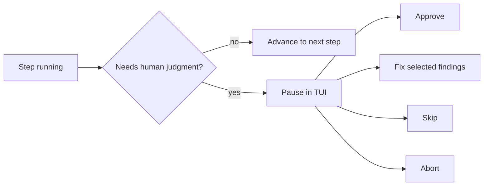

The TUI is how you interact with running pipelines. Launch it with
`no-mistakes` or `no-mistakes attach`.

Think of it as the control surface for the gate. It is optimized for one job:
show you where the run is, why it paused, what changed, and what your choices
are without making you bounce between logs, diffs, and provider tabs.

Bare `no-mistakes` can also open the [Setup Wizard](/no-mistakes/guides/setup-wizard/) first when there is no active run on the current branch and you need to create one.

## What the TUI is for



In practice, each part of the screen answers a different question:

- **Pipeline box** - where am I in the run?
- **Findings panel** - why did this pause?
- **Diff panel** - what changed during the fix cycle?
- **Log tail** - what is the step doing right now?

## Layout

The layout adapts to terminal width:

- **Wide (100+ columns):** pipeline box on the left, findings/log/diff panel on the right, side by side
- **Narrow (<100 columns):** pipeline box stacked above the findings panel

### Pipeline box

Shows the branch name and run status in the header, followed by each step:

```
  feature/login-fix  running
  ────────────────────────────
  – Intent
  │
  ✓ Rebase            320ms
  │
  ⏸ Review     - awaiting approval       2/3 fixed
  │
  ○ Test
  │
  ○ Document
  │
  ○ Lint
  │
  ○ Push
  │
  ○ PR
  │
  ○ CI
```

Step status icons:

| Icon | Status |
|---|---|
| `○` | Pending |
| (spinner) | Running / Fixing |
| `⏸` | Awaiting approval / Fix review |
| `✓` | Completed |
| `–` | Skipped |
| `✗` | Failed |

Completed steps show their duration.
Steps with fixed findings, and steps currently fixing reported findings, show a right-aligned count such as `2/3 fixed` or `0/3 fixed`.
The first number counts completed fixes, not findings selected for an in-progress fix.
Connectors (`│`) between steps are hidden when the terminal height is under 30 lines.

### Findings panel

When a step pauses for approval, the findings panel shows structured results:

```
  Risk: MEDIUM
  Potential null pointer in error path

  > [x] E  src/handler.go:42
          Missing nil check before dereferencing resp.Body
         > keep the existing retry behavior
    [x] I  [user]
          Also update the CLI help text for this new flag
         > mention the env var in the docs too
    [x] W  src/handler.go:78
          Error string should not be capitalized
    [ ] I  src/handler.go:95
          Consider extracting this into a helper function
```

- Severity icons: `E` (error, red), `W` (warning, yellow), `I` (info, blue)
- Checkboxes: `[x]` (selected, green), `[ ]` (deselected, dim)
- Blue `>` marks the focused finding
- User-added findings are marked with `[user]`
- Per-finding notes render inline as `> ...` and are sent with the next fix request
- Bottom hint shows `↑ N above / ↓ N more below (j/k)` when scrolling, or `(j/k)` whenever there are multiple findings

### Diff panel

After a fix cycle, press `d` to toggle the diff view:

- Stats header showing files changed, additions, and deletions
- Syntax-colored unified diff with line number gutter
- Finding context line showing which finding you're viewing
- Scroll position in the box title: `Diff (45/312)`

### Log tail

During running steps, shows streaming agent output. Lines starting with `PASS` are green, `FAIL` are red, everything else is dim.

On narrow terminals, the log panel expands to fill the remaining vertical space below the pipeline box instead of staying at the compact fixed height used in shorter layouts.

### CI panel

While the CI step is active, the TUI shows a dedicated CI panel instead of the generic findings view.
It shows the PR label, the latest CI activity, and a log tail.
When a real CI auto-fix attempt starts, the panel increments `CI auto-fixes: N`.
Once checks are green and known mergeability is clear, the panel shows `✓ Checks passed` with `still monitoring until merged or closed`, and the terminal title switches to `Checks passed`.
That text means the CI monitor is still active; it can still pause later if the configured idle timeout elapses with no base-branch movement.
That ready signal clears if checks start running again, new failures appear, provider state becomes uncertain, or the PR is merged or closed.
The ready signal is persisted, so a fresh attach shows `Checks passed` without depending on delivery of an earlier log line.

### Local branch

When the pipeline creates a fix commit in its isolated worktree, one compact `Local branch` box explains whether the invoking branch is unchanged, behind, dirty, diverged, synchronized, or retired after PR merge or close.
Passive TUI rendering uses cached pipeline push provenance and never fetches or mutates the checkout.
When a clean strict-behind relation is eligible, the box alone offers `u sync branch`.
Pressing `u` explicitly refreshes the configured upstream or fork target, then opens a confirmation with both full SHAs, the exact target ref, and the clean-worktree proof.
Confirm with `u` or Enter, or cancel with Escape.
The apply path rechecks every mutable assumption and can only perform the same exact strict fast-forward as `no-mistakes sync`; blocked states never trigger destructive Git recovery.

### Footer

The footer shows detach/help/yolo actions and, when `no-mistakes attach` has a cached newer release available, a right-aligned `<version> available` indicator. That update indicator stays visible after reruns in the same TUI session.
When yolo mode is on, the footer changes from `y yolo` to `y end yolo`.

## Keybindings

### Navigation

| Key | Action |
|---|---|
| `j` / `k` | Scroll down / up |
| `g` / `G` | Jump to start / end |
| `Ctrl+d` / `Ctrl+u` | Half-page down / up |
| `n` / `p` | Next / previous finding |

### Actions (when a step is awaiting approval)

| Key | Action |
|---|---|
| `a` | Approve - continue to next step |
| `f` | Fix - send selected findings to agent for fixing |
| `s` | Skip - skip this step and continue |
| `x` | Abort - press twice to confirm (first press shows warning) |
| `o` | Open PR URL in browser (when available) |

### Selection

| Key | Action |
|---|---|
| `space` | Toggle current finding |
| `A` | Select all findings |
| `N` | Deselect all findings |
| `e` | Edit fix note for the current finding |
| `+` | Add a user-authored finding |
| `D` | Delete the current user-authored finding |

When the instruction editor is open, press `Ctrl+s` or `Ctrl+enter` to save, or `esc` to cancel. In the add-finding editor, use `tab` / `shift+tab` to move between fields, `Ctrl+s` to save, and `esc` to cancel.

### View

| Key | Action |
|---|---|
| `d` | Toggle diff view (after fix cycle) |
| `esc` | Exit diff view back to findings |
| `?` | Toggle help overlay |
| `y` | Toggle yolo mode, which auto-resolves paused steps |
| `r` | Start a rerun after a failed or cancelled run |
| `u` | Refresh and confirm local branch synchronization when offered |
| `q` | Detach from TUI (or quit if run is done) |

In diff view, `n`/`p` jumps the viewport to the file and line of the next/previous finding.

## Action bar

The action bar appears below the pipeline box when a step is awaiting approval:

```
Review awaiting action:
 a approve  f fix (3/5)  s skip  x abort  d diff
 [space] toggle  e edit  + add  A all  N none
```

The `f fix (3/5)` label shows how many findings are selected out of the total.

Press `e` to add or edit extra guidance for the current finding. Press `+` to add your own finding to the list. User-authored findings start selected by default and can be removed with `D`.

Press `y` to toggle yolo mode when you want paused approval gates to resolve automatically.
Yolo fixes gates with `auto-fix` and `ask-user` findings by selecting every finding, then approves the resulting fix-review gate.
It approves gates with no findings or only `action: no-op` findings as-is, and fixes each step at most once so unresolved findings do not loop forever.

## Outcome banner

When a run finishes, a one-line banner appears:

- `✓ Pipeline passed  4.2s` (green) - the run finished successfully, even if later steps were auto-skipped
- `✗ Review failed  1.8s` (red) - names the failing step
- `✗ Pipeline cancelled` (red) - user aborted

After a failed or cancelled run, press `r` to start a rerun. The TUI switches to the new run automatically.

## Detaching

Press `q` to detach from the TUI. The pipeline continues running in the background. Run `no-mistakes` again to reattach to the active run on your current branch, or `no-mistakes attach` to reattach to the repo's active run without branch scoping.

If the run is already finished, `q` exits the TUI.
