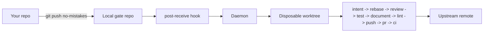

`no-mistakes` puts a local git proxy in front of your real remote. Push to
`no-mistakes` instead of `origin`, and it spins up a disposable worktree, runs
an AI-driven validation pipeline, forwards upstream only after every check
passes, and opens a clean PR automatically.

## The Bottleneck Moved

AI agents can write and modify code faster than most teams can validate it. The
expensive part is no longer producing the diff. It is making sure the diff is
rebased, reviewed, tested, documented, linted, and safe to share.

Pre-commit hooks help, but they need to stay lightweight and they block your
working tree. CI helps, but it usually runs after the push is already public.
Branch protection can reject bad outcomes, but it does not help get a branch
ready.

`no-mistakes` sits in that gap. It gives you a deliberate local gate before the
branch reaches upstream:

- **Before** the code is public, it rebases, runs a structured AI code review, runs baseline tests, gathers user-facing test evidence when intent is available, checks that docs are in sync, runs lint, and only then pushes upstream and opens the PR.
- **After** the push, it watches CI and auto-fixes failures. On GitHub and GitLab it also watches PR mergeability and fixes merge conflicts on the branch.
- **Throughout**, every step can pause for your approval. You see the findings, pick what to fix, and decide when to ship.

The whole thing runs in a disposable worktree. Your working directory is never
touched, so you can keep coding while the pipeline runs.

## Why The Remote Is Named

`no-mistakes` is a separate remote on purpose.

- `origin` is never rewritten or hijacked.
- `git push origin` still behaves exactly like normal Git.
- `git push no-mistakes` is an explicit signal that this branch should go
  through the full gate.

That design matters for trust. The tool is not trying to hide Git from you. It
is trying to make one deliberate path mean something consistent.

## Mental model

`origin` is never hijacked. Regular `git push` still works normally. You opt
into the gate by pushing to the `no-mistakes` remote.

## What "Passed The Gate" Means

When a branch passes the gate, it means:

- it was checked against fresh upstream
- the fixed pipeline ran in order
- review, tests, user-facing test evidence when available, docs, and lint happened before the upstream push
- you had a chance to approve, fix, skip, or abort any blocking step

## What you get

- A fixed, opinionated pipeline: `intent → rebase → review → test → document → lint → push → pr → ci`. Order is not configurable; what each step runs is.
- Choice of agent: `claude`, `codex`, `rovodev`, `opencode`, `pi`, or `acp:<target>` via `acpx`, with per-repo override.
- A TUI to watch, approve, fix, skip, or abort any step.
- A `/no-mistakes` agent skill so a coding agent can do a task and gate it, or gate existing committed work, backed by a non-interactive `no-mistakes axi` interface.
- A setup wizard when you run bare `no-mistakes` with no active run on the current branch - it walks you through creating a branch, committing, and pushing through the gate, then attaches if the daemon registers the new run.

## Three ways to trigger the gate

The pipeline is the same no matter how you start it. There are three first-class entry points, one for each way you tend to be working when a change is ready:

- **`git push no-mistakes`** - the explicit Git path. You push a committed branch to the gate remote instead of `origin`, and the daemon takes it from there. See [Quick Start](/no-mistakes/start-here/quick-start/).
- **`no-mistakes`** - the terminal UI. Run it after making changes and a [setup wizard](/no-mistakes/guides/setup-wizard/) walks you through branch, commit, and push, then attaches to the live run so you can watch, approve, fix, skip, or abort each step.
- **`/no-mistakes`** - the agent skill. Tell a coding agent `/no-mistakes <task>` to have it do the task, commit it on a feature branch, and then gate it with that task as intent; use bare `/no-mistakes` to gate existing committed work. It resolves safe findings on its own and stops to relay anything that needs your decision. See [Driving no-mistakes as an agent](/no-mistakes/guides/agents/#driving-no-mistakes-as-an-agent).

`no-mistakes init` installs the `/no-mistakes` skill at user level for every supported agent, so it works in all your repos. The skill drives `no-mistakes axi`, a non-interactive command surface that prints [TOON](https://toonformat.dev) to stdout, so an agent reaches the same gate and the same approval points you get in the TUI.

## Next

- [Quick Start](/no-mistakes/start-here/quick-start/) - first push in five minutes
- [Installation](/no-mistakes/start-here/installation/) - full install options
- [The Gate Model](/no-mistakes/concepts/gate-model/) - architecture and design decisions
